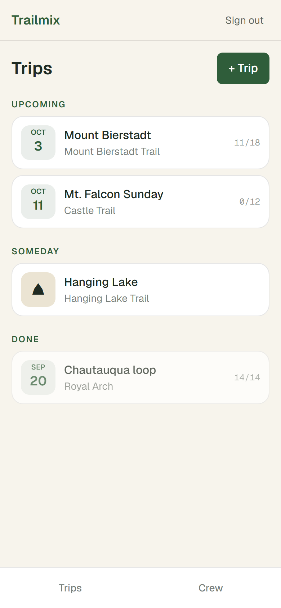
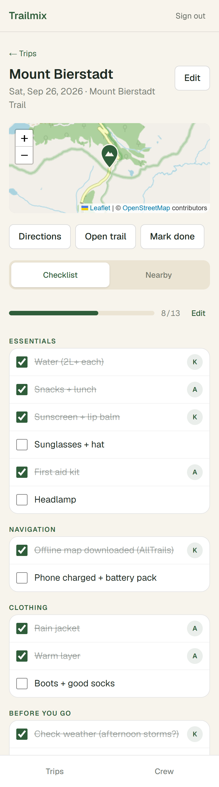
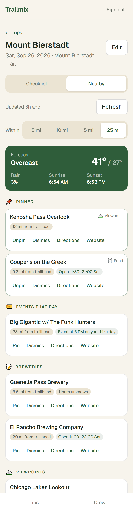
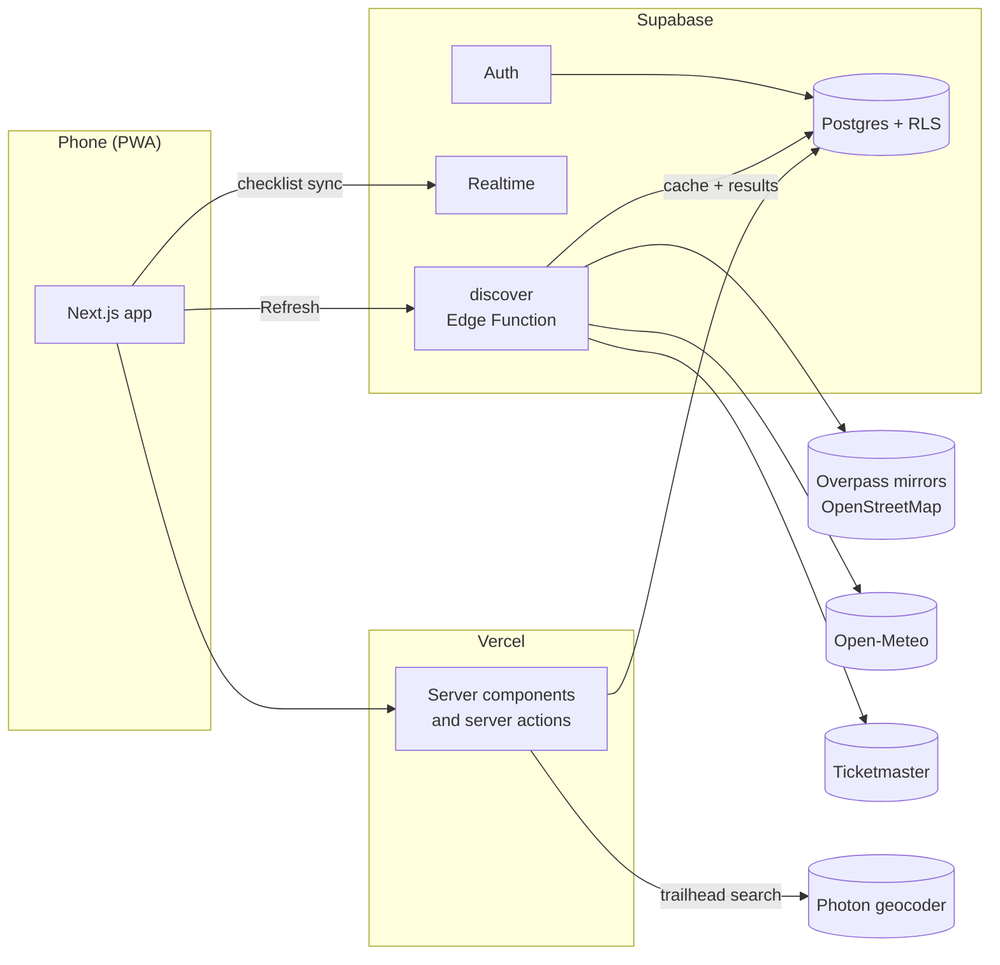

# Trailmix

A small, mobile-first web app for planning hikes with a partner. Save a trail, pick a date, share a checklist, and see what's open and happening near the trailhead that day: breweries, food, viewpoints, events, and the forecast.

<p align="center">
  
  
  
</p>
<p align="center"><sub>Trips · shared checklist · what's nearby (sample trips and checklist; places are real OpenStreetMap results near Mt. Bierstadt)</sub></p>

## Why this exists

AllTrails is great for finding trails and recording hikes. The annoying part is everything around it: finding the trail, then separately digging around for a brewery that's open after, an event in town that evening, and whether afternoon storms are coming. Trailmix does that second part and keeps a checklist we can both tick off from our phones.

It deliberately doesn't do GPS tracking, trail search, or social features. Recommendations are **deterministic and explainable**: every suggestion says why it's there ("0.8 mi from trailhead", "Open 11:00–21:00 Sat", "Event at 7:30 PM on your hike day"). No LLM decides what's on the list.

## Features

- **Crews:** a shared space for two (or more) people. Invite with a single-use code or link; trips and checklists are shared automatically.
- **Trips:** trail name, AllTrails link, date (or "someday"), and a trailhead pin. Find the trailhead by name search, by pasting coordinates or a Google/Apple Maps link (share links included), by tapping the map, or with your current location.
- **Checklists (optional):** start from a reusable template like "Day hike", or add items as you go. Check items off on either phone and it syncs live, showing who checked what.
- **Nearby:** the day's forecast plus ranked places and events near the trailhead, grouped by category, within 5–25 mi. Pin favorites, dismiss the rest; both stick across refreshes.
- **Installable:** add it to your home screen as a PWA.

## How it works



- **Sharing is enforced in the database.** Every table has row-level security keyed on crew membership (`is_crew_member()`), with SQL tests proving a non-member can't read or change another crew's trips.
- **Discovery runs in one Edge Function.** It fetches OpenStreetMap places, events, and the forecast in parallel. One source failing makes the run *partial*, not failed. Places are a shared cache (7 days per area), results are deduplicated (same name within 75 m), checked against opening hours on the trip date, and scored:

  ```
  score = category_weight × distance_factor × open_factor × event_bonus
  ```

  The pure logic (normalization, dedupe, hours, scoring) lives in `supabase/functions/_shared/discovery/` with no I/O and its own tests.

See [`docs/SPEC.md`](docs/SPEC.md) for the full data model, pipeline, and roadmap.

## Stack

Next.js (App Router, TypeScript), Tailwind · Supabase (Postgres + RLS, Auth, Realtime, Edge Functions on Deno) · Leaflet + OpenStreetMap tiles · Vercel · Vitest and Deno test.

## Running it yourself

My hosted instance is private (sign-ups are closed), so to try it, run your own copy. It takes a free Supabase project and about 15 minutes.

You'll need Node 20+, a [Supabase](https://supabase.com) project, and optionally a free [Ticketmaster Discovery API](https://developer.ticketmaster.com) key for events. Docker isn't required; everything below targets a hosted Supabase project.

1. **Install and configure**
   ```bash
   npm install
   cp .env.example .env.local   # fill in your project URL and publishable key
   ```
2. **Link Supabase and apply migrations**
   ```bash
   npx supabase link --project-ref <your-project-ref>
   npx supabase db push
   ```
   In the Supabase dashboard, turn off **Auth → Email → Confirm email** (sign-in is email + password until custom SMTP is set up).
3. **Deploy the discovery function and its secrets**
   ```bash
   npx supabase secrets set OSM_CONTACT_EMAIL=you@example.com TICKETMASTER_API_KEY=your_key
   npx supabase functions deploy discover --use-api
   ```
4. **Run the app**
   ```bash
   npm run dev
   ```

To deploy, import the repo in Vercel and set the same variables as in `.env.example`.

## Tests

```bash
npm test                   # Vitest: app-side helpers (e.g. Maps link parsing)
npm run test:functions     # Deno: discovery logic (needs Deno, or: npx deno test supabase/functions)
npx supabase db query --linked -f supabase/tests/rls_phase1.sql   # RLS checks (rolled back)
npx supabase db query --linked -f supabase/tests/rls_phase2.sql
```

`supabase/functions/_dev/smoke-sources.ts` runs the real place and weather sources for a coordinate, without touching the database.

## Project layout

```
src/app/(auth)/            sign in / sign up
src/app/(app)/             trips, trip detail (checklist + nearby), crew, templates
src/lib/                   Supabase clients, Maps link parsing, external clients
supabase/migrations/       schema + RLS
supabase/functions/        discover Edge Function, shared clients, pure discovery logic
supabase/tests/            SQL RLS tests
docs/SPEC.md               spec and roadmap
```

## Data sources

Place data © [OpenStreetMap](https://www.openstreetmap.org/copyright) contributors, via community Overpass mirrors and [Photon](https://photon.komoot.io). Weather by [Open-Meteo](https://open-meteo.com). Events from Ticketmaster. Map tiles © OpenStreetMap.
